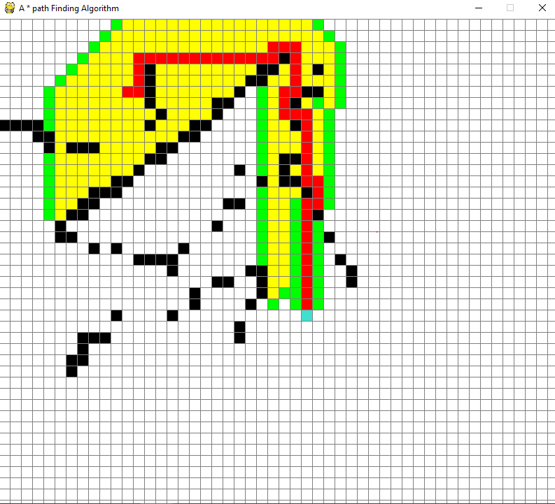

# A*-Path-finding-visualizer

## Installation 

2) ```Pip install pygame```

3) Run ```python 'file_name.py'``` in terminal

4) Place start point ```dark blue``` and end point ```light blue``` and make barrier if you want ```black color```

```spacebar``` to start visuzlizer and ```ctrl + c``` to clear board 

## Screenshot


